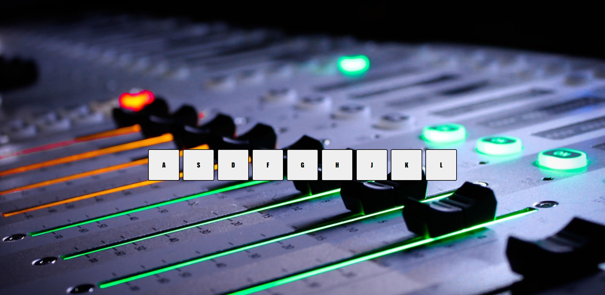

# Drum-kit

## Primer proyecto de #JavaScript30

Según pulses una de las teclas que aparecen en la pantalla, sonará un sonido distinto simulando una batería, y se iluminará unos segundos la tecla seleccionada.

</img>

---

 <footer> :computer: by Nuria :metal: </footer>
